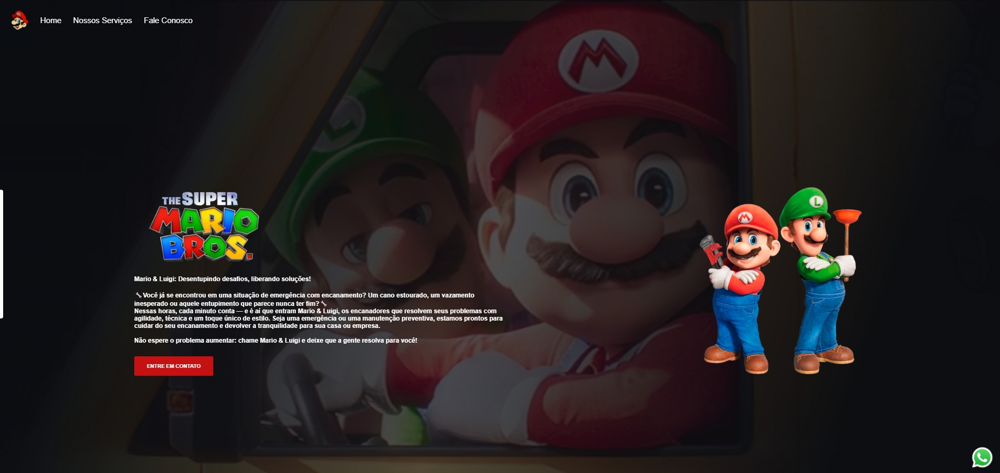

# 🚰 Mario & Luigi - Encanadores

> Mario & Luigi: Desentupindo desafios, liberando soluções! 🔧

Link do Repositório: https://github.com/EmanuelRamos22/Projeto-DevClub

---

## 📸 Preview

---

## ✨ Funcionalidades

- ✅ Página inicial com apresentação da empresa  
- ✅ Seção com serviços oferecidos  
- ✅ Formulário de contato integrado ao **Formcarry**  
- ✅ Vídeo de fundo com efeito de máscara  
- ✅ Botão fixo de WhatsApp no canto da tela

---

## 🚀 Tecnologias Utilizadas

- 🏗 **HTML5**
- 🎨 **CSS3**
- ⚡ **JavaScript**
- 📩 **Formcarry**

---

## 📂 Estrutura do Projeto

📦 PROJETO 1000
┣ 📂 img
┃ ┣ backgroud.jpeg
┃ ┣ logo-header.png
┃ ┣ logo.png
┃ ┣ luigi.png
┃ ┣ mario.png
┃ ┣ preview.jpg
┃ ┣ video.mp4
┃ ┗ whatsapp.png
┣ 📜 index.html
┣ 📜 README.md
┣ 📜 scripts.js
┣ 📜 serviços.css
┣ 📜 serviços.html
┣ 📜 serviços.js
┗ 📜 style.css

---

## 🎨 Layout

- Paleta de cores baseada em **vermelho (Mario)** e **verde (Luigi)**  
- Tipografia: **Poppins** (Google Fonts)  
- Layout **responsivo** e **moderno**

---

## 📞 Contato

- 📧 Email: emanuelabreuros1@gmail.com  
- 📱 WhatsApp: [Clique aqui](https://wa.me/qr/X7PCL4HZ2I2XD1)

---

👨‍💻 Desenvolvido por **Emanuel Ramos**

